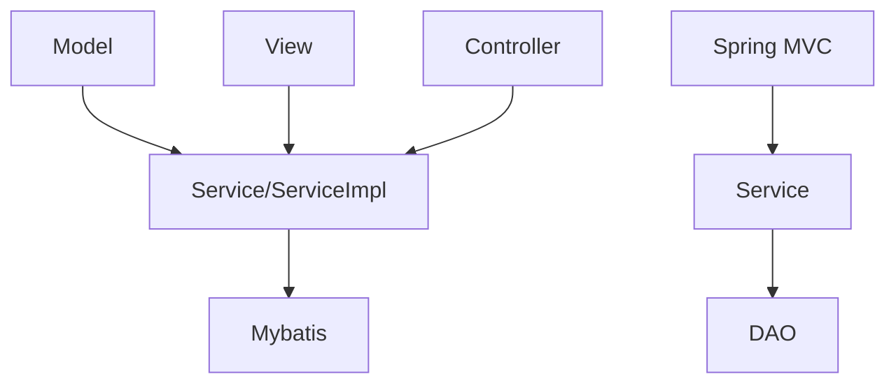

# JavaEE Project Report

Final project of JavaEE course, Fall 2020, Tongji University

## System Functionalities

- Register & Login & Logout

- Send new blogs when login(support markdown syntax)

- Comment blogs when login

- View comments of a blog

- Like and Star blogs when login

- See who likes your blog

- Sort blogs on index page by date or like


## User Manual

- Use nickname, e-mail address, password to register a new account, the password's length should longer than 7 characters and less than  17 characters.

- After register, you can use the e-mail address and password to sign in.

- Before login, there are only Home and Sign In button on home page.

- You can see all blogs and comments as a visitor, but cannot send blogs, comment blogs, like blogs or star blogs.

- You can choose the sorting method of the blogs in the home page, the default method is sort by date.

- After login, you can do all actions mentioned before.

- When sending blogs, you can use markdown syntax.

- When sending blogs or writing comment, your submit will be checked. If your message contains sensitive words, your submission will fail.

- After login, About button, which is your nick name,  and Send Blog button will be added to the home page, the Sign In button will be replaced by the Log Out button.

- In About page, you can see the blogs you sent and the blogs you stared, you can also delete your blogs or stared blogs

    

## System Architecture and Component Design




### System Architecture

- Design DAO Layer to connect database
- Design Service Layer to provide interfaces for manipulate database
- Design View Layer to show information to users
- Design Controller Layer to deal with URL requests
  - Use interface in Service Layer to manipulate database
  - Add an object to View Layer

### Component Design

- User design, ordinary setters and getters are omitted

  - Field userId  is unique, used as the primary key
  - Field email is unique, it will be checked while registering an account

  ```
  public class User {
      private Integer userId;
      private String nickname;
      private String email;
      private String password;
      private Timestamp registrationTime;
  
      public User(String nickname, String email, String password) {
          this.nickname = nickname;
          this.email = email;
          this.password = password;
      }
  }
  ```

  

- Blog design, ordinary setters and getters are omitted

  - Field blogId is unique, used as the primary key
  - Field authorId and authorNickname store author information
  - Field title, content, like, view, star, date store the information about a blog
  - Field isLike and isStar show whether this blog is liked or stared by a particular user

  ```java
  public class Blog {
      private Integer blogId;
      private Integer authorId;
      private String authorNickname;
      private Integer privateIndex;
      private String title;
      private String content;
      private Integer like;
      private Integer view;
      private Integer star;
      private Timestamp date;
      private Boolean isLike;
      private Boolean isStar;
  
      public String getContent() {
          String h5content = MdToHtml.convert(content);
          return h5content;
      }
  
      public String getFormattedTime() {
          long interval = System.currentTimeMillis() - date.getTime();
          StringBuilder sb = new StringBuilder();
          if(interval < 1000 * 60){
              sb.append("just now");
          }
          else if (interval < 1000 * 3600) {
              sb.append(interval / 60000);
              if(interval < 120000){
                  sb.append(" minute ago");
              }
              else{
                  sb.append(" minutes ago");
              }
          }
          else if (interval < 1000 * 3600 * 24) {
              sb.append(interval / 3600000);
              if(interval < 7200000){
                  sb.append(" hour ago");
              }
              else{
                  sb.append(" hours ago");
              }
          }
          else{
              SimpleDateFormat dateFormat = new SimpleDateFormat("yyyy-MM-dd HH mm");
              sb.append(dateFormat.format(date));
          }
          return sb.toString();
      }
  }
  ```

  

- Comment design, ordinary setters and getters are omitted

  - Field commentId is unique, used as the primary key
  - Field blogId show the blog which this comment was sent to
  - Field content show the content of the comment, date show the send time of a comment
  - Field senderId and senderNickname show information about the user who sent the blog

  ```java
  public class Comment {
      private Integer commentId;
      private Integer blogId;
      private String content;
      private Integer senderId;
      private String senderNickname;
      private Timestamp date;
      
  	public String getFormattedTime() {
          long interval = System.currentTimeMillis() - date.getTime();
          StringBuilder sb = new StringBuilder();
          if(interval < 1000 * 60){
              sb.append("just now");
          }
          else if (interval < 1000 * 3600) {
              sb.append(interval / 60000);
              if(interval < 120000){
                  sb.append(" minute ago");
              }
              else{
                  sb.append(" minutes ago");
              }
          }
          else if (interval < 1000 * 3600 * 24) {
              sb.append(interval / 3600000);
              if(interval < 7200000){
                  sb.append(" hour ago");
              }
              else{
                  sb.append(" hours ago");
              }
          }
          else {
              SimpleDateFormat dateFormat = new SimpleDateFormat("yyyy-MM-dd HH:mm");
              sb.append(dateFormat.format(date));
          }
          return sb.toString();
      }
  }
  ```

  

- Like design, ordinary setters and getters are omitted

  ```java
  public class Like
  {
  	private int userId;
  	private String nickname;
  	private int blogId;
  }
  ```

  

- Star design, ordinary setters and getters are omitted

  ```
  public class Star {
  	private int userId;
  	private int blogId;
  }
  ```

  

- Webpage design

  - Index page

    - Navigation bar, link to other pages, includes Home, Send Blog, About, Log Out, Sign In
    - A form enable user to choose sort method of the blogs
    - A list show all the blogs in given order

  - Send blog page

    - Cannot be accessed before sign in
    - A form, submit the title and content of a blog

  - Detail page

    - Display the information about a blog
    - A list show all the comments under the blog
    - If sign in, a form to submit the content of comment

  - About page

    - A link to Star List page, which show the blogs current user stared

    - A list of blogs sent by the current user
    - Delete blog button

  - Login page & Register page

    - A form to submit email and password
    - In Register page, the form will send nickname and confirm the password as well

- Controller design

  - Index Controller
    - Return index page
    - Return index page that blogs are sorted in the given order
    - Return the about page of a user
    - return Post Avatar page and offer upload function
    - Log out function
  - Login Controller
    - Judge if the user email address exists, and if the password matches
  - Register Controller
    - Use interface in Service Layer to write information to database
  - Post Controller
    - View a particular blog
    - Send blogs or comments
    - Delete blog
  - Star Controller
    - Star a blog
    - Remove a star blog
    - Show star list
  - Like Controller
    - Like a blog
    - Show like list

## Database Design

### users

| Field Name | Data Type | Length |Example| Note |
| ------ | :------: | :------: | :------: | :------: |
| userId | int | 30 | 1 |primary key,auto_increment|
| nickname | char | 30 | hello ||
| email | char | 30 | 123@qq.com ||
| password | char | 128 | 12345678 | after md5 encryption |
| registrationTime | timestamp |  | 2020-12-24 15:59:55 | timezone:shanghai |
| userImage | mediumtext |  | afraid.jpg | base64 Image String |

### blogs

| Field Name | Data Type | Length |Example| Note |
| ------ | :------: | :------: | :------: | :------: |
| blogId | int |  | 1 |primary key,auto_increment|
| privateIndex | int |  | 1 | the index of the author's blogs |
| authorId | int | | 1 |  |
| authorNickname | char | 30 | Yun Ma |  |
| title | char | 30 | hello |  |
| content | varchar |  300   | Hello World! |  |
| like | int |  | 0 |  |
| view | int |  | 0 |  |
| star | int |  | 0 |  |
| date | timestamp |  | 2020-12-24 15:59:55 | timezone:shanghai |

### comments

| Field Name | Data Type | Length |Example| Note |
| :----: | :------: | :------: | :------: | :------: |
| blogId | int |  | 1 ||
| content | varchar | 300 | hello |  |
| senderId | int |  | 1 |  |
| senderNickname | char | 30 | Yun Ma |  |
| date | timestamp |        | 2020-12-24 15:59:55 | timezone:shanghai |


### likes


| Field Name | Data Type | Length |Example| Note |
| ------ | :------: | :------: | :------: | :------: |
| userId | char | 30 | 1 |  |
| nickname | varchar | 30 | Ge Mao |  |
| blogId | int | 30 | 1 |  |

### stars

| Field Name | Data Type | Length | Example | Note |
| :--------: | :-------: | :------: | :------: | :------: |
|   userId   |    int    |        |    1    |      |
|   blogId   |    int    |        |    1    |      |

## Other Technical Details and/or Information

- Blog formatting supports markdown syntax.
- Blog and comment will be checked by text moderation service provided by Tencent Cloud